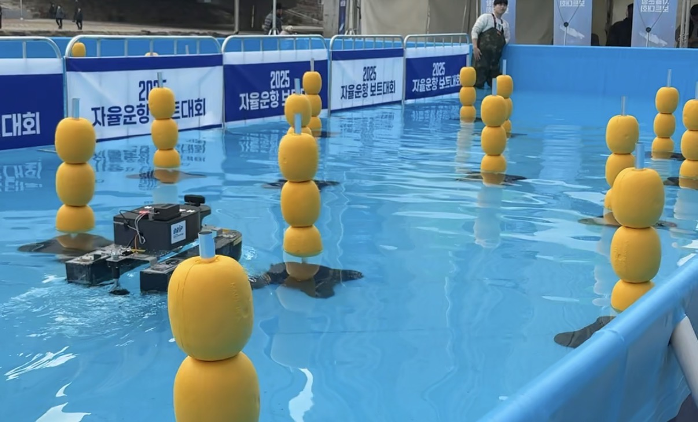

# usv-obstacle-avoidance
Obstacle avoidance algorithm for an autonomous boat (ROS2)
# 자율운항 보트 장애물 회피 알고리즘 (ROS2)

교내 자율운항선박 경진대회에서 사용한 장애물 회피 알고리즘 코드입니다.
센서 데이터를 기반으로 장애물을 탐지하고, 회피 경로를 선택한 뒤 조향 및 추진기 제어까지 연결하도록 구성했습니다.

## 1. 프로젝트 개요

* 대회: 교내 자율운항선박 경진대회 (장려상)
* 역할: 팀장 및 전체 총괄, 장애물 회피 알고리즘 구현
* 환경: ROS2 기반 자율운항 보트

## 2. 사용 센서 및 제어 대상

* 입력 센서

  * LiDAR (`/scan`)
  * IMU (`/imu/data`)
  * GPS (`/gps/fix`)
* 출력 제어

  * 추진기 출력 (`/actuator/thruster/percentage`)
  * 조향각(Key degree) (`/actuator/key/degree`)

## 3. 코드 구성 (핵심 함수)

* `imu_callback()`

  * IMU 쿼터니언을 헤딩(Yaw)으로 변환하고 보정 헤딩을 계산
* `gps_callback()` / `check_waypoint_reached()`

  * 현재 위치 업데이트 및 웨이포인트 도달 여부 확인
* `lidar_callback()`

  * LiDAR 데이터 전처리 → 장애물 탐지 → 회피 경로 계산 호출
* `calculate_path()`

  * 장애물 개수에 따라 단일/복수 장애물 회피 전략 분기
* `avoid_single_obstacle()`

  * 단일 장애물 기준 좌/우 회피 경로 비교 후 선택
* `avoid_obstacles()`

  * 복수 장애물 사이 경로 후보를 비교해 최적 회피 경로 선택
* `navigate_to_angle()`

  * 선택된 목표 각도에 따라 조향/추진 제어

## 4. 장애물 회피 알고리즘 흐름

1. LiDAR 데이터 수신
2. 거리값 전처리 (범위 제한 + 중앙값 필터)
3. 장애물 후보 추출
4. 장애물 개수(단일/복수)에 따라 회피 전략 분기
5. 목표 회피 각도 결정
6. 조향각 및 추진기 출력 제어

## 5. 실행 코드

* `autonomous_boat.py`

## 6. 시연 영상

* [교내대회 장애물 회피 시연 영상 (Naver MYBOX)](https://mybox.naver.com/main/web/my/viewer/3472595643618491720:18582608?resourceKey=d2pkZ2hjanN3bzEwfDEwNjcyMjg4MXxEfDA&fileResourceKey=d2pkZ2hjanN3bzEwfDM0NzI1OTU2NDM2MTg0OTE3MjB8Rnww&downloadable=true&editable=true)

## 7. 관련 이미지

* 교내대회 장애물 회피 시연 사진
  

## 8. 결과 및 회고

* 대회장 환경에서 GNSS 수신 불안정으로 웨이포인트 추종에는 어려움이 있었음
* 장애물 회피 기능 자체는 현장에서 안정적으로 동작함을 확인함
